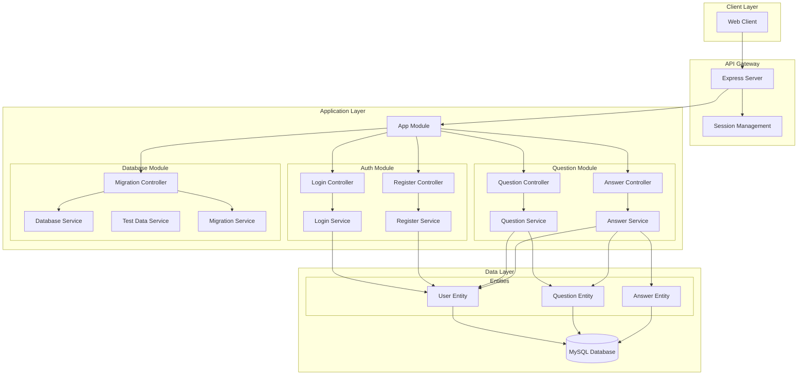
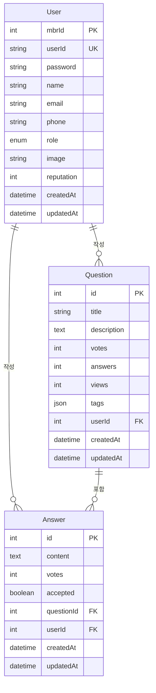
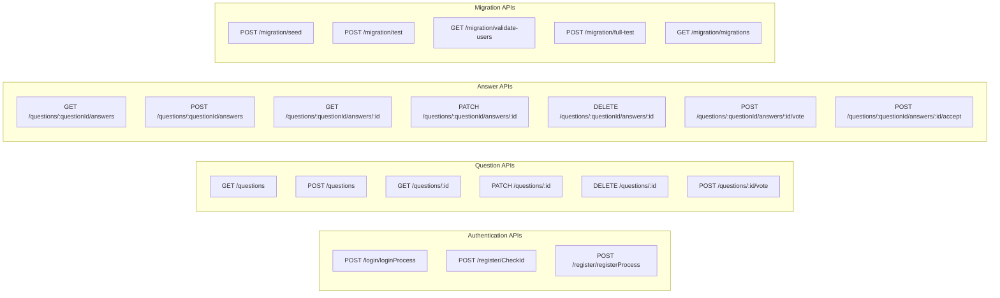
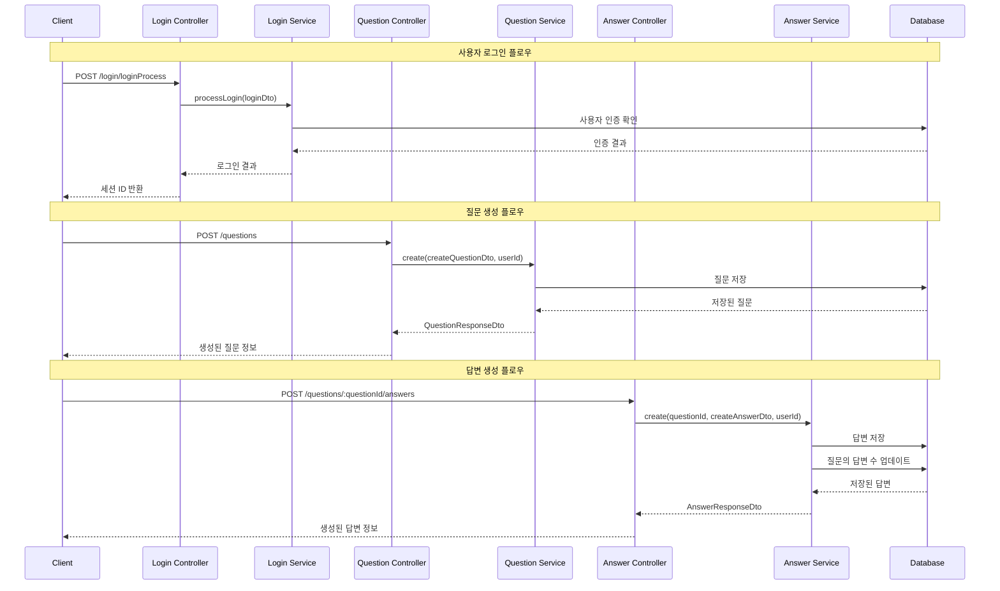
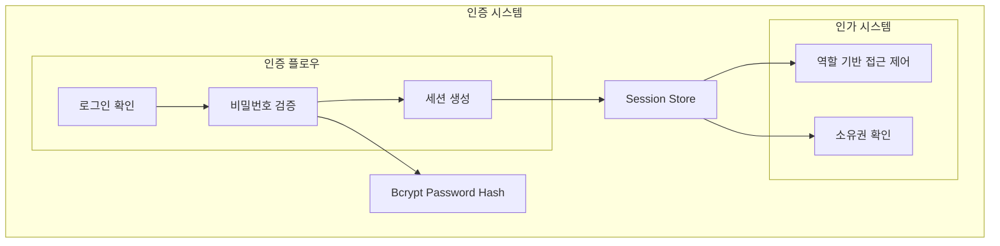

# NestJS Q&A 플랫폼 서비스 아키텍처

## 시스템 개요
Stack Overflow와 유사한 질문-답변 플랫폼으로, 사용자 인증, 질문 관리, 답변 관리 기능을 제공합니다.

## 아키텍처 다이어그램

### 전체 시스템 구조


### 데이터베이스 관계도


### API 엔드포인트 구조


### 서비스 플로우


### 보안 및 인증 구조


## 주요 기능

### 1. 사용자 관리
- **회원가입**: 아이디 중복 확인, 비밀번호 암호화
- **로그인**: 세션 기반 인증
- **사용자 역할**: USER, ADMIN 구분
- **평판 시스템**: 활동에 따른 평판 점수

### 2. 질문 관리
- **질문 CRUD**: 생성, 조회, 수정, 삭제
- **투표 시스템**: 질문에 대한 추천/비추천
- **태그 시스템**: JSON 형태의 태그 저장
- **조회수 추적**: 질문 조회 시 자동 증가

### 3. 답변 관리
- **답변 CRUD**: 생성, 조회, 수정, 삭제
- **답변 투표**: 답변에 대한 추천/비추천
- **답변 채택**: 질문 작성자가 최적 답변 선택
- **중첩 구조**: 질문-답변 관계 유지

### 4. 데이터베이스 관리
- **Migration 시스템**: TypeORM 기반 스키마 관리
- **테스트 데이터**: 개발/테스트용 샘플 데이터
- **데이터 유효성 검증**: 데이터 무결성 확인

## 기술 스택

### Backend
- **Framework**: NestJS
- **Database**: MySQL
- **ORM**: TypeORM
- **Authentication**: express-session
- **Password**: bcrypt
- **Validation**: class-validator, class-transformer

### 개발 도구
- **Language**: TypeScript
- **Build**: SWC
- **Testing**: Jest
- **Linting**: ESLint + Prettier
- **Migration**: TypeORM CLI

## 배포 및 운영

### 환경 설정
```bash
# 데이터베이스 초기화
npm run db:init

# 개발 서버 실행
npm run start:dev

# 테스트 데이터 생성
npm run db:seed
```

### 주요 환경 변수
- `DB_HOST`: 데이터베이스 호스트
- `DB_PORT`: 데이터베이스 포트
- `DB_USERNAME`: 데이터베이스 사용자명
- `DB_PASSWORD`: 데이터베이스 비밀번호
- `DB_NAME`: 데이터베이스 이름